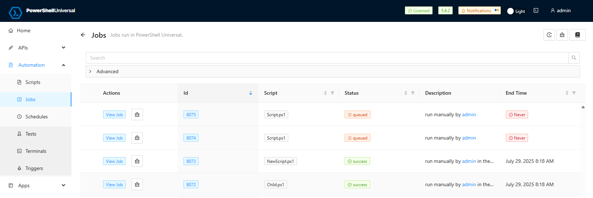

## Install PowerShell Universal

  

PowerShell Universal is a single pane of glass for managing your automation environment. The server is cross-platform. You can install it by using PowerShell, using a Windows MSI, with Chocolatey, or run as a Docker container. 

[Download](https://powershelluniversal.com/downloads) | [💡Learn More About Installing PowerShell Universal](https://docs.powershelluniversal.com/getting-started)