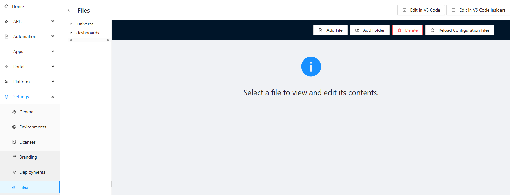

## Connect Visual Studio Code

The PowerShell Universal Visual Studio Code extension requires connection information to login to your PowerShell Universal instance. Once logged into PowerShell Universal, click Settings \ Files and then Edit with VS Code. You'll be prompted and VS Code will be configured automatically.

  

[💡 Settings \ Files](http://localhost:5000/admin/settings/files)